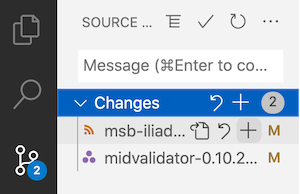
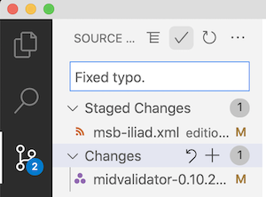
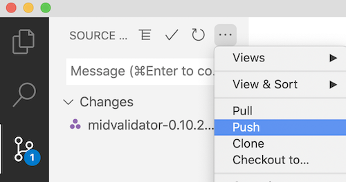

# Committing your work

The session host is responsible for keeping the team's work up to date on github.  You should push your work to github whenever you sucessfully validate a section of work.

The three steps to push your work to github are:

1. *stage* (or *add*) files to the list to commit
2. *commit* the files (with a good descriptive message)
3. *push* the files to github

This is very easy to do in VS Code.

## 1. Stage (add) files to commit

First, select the "Source control" icon from the vertical column of icons on the left side of VS Code. It looks like a kind of network graph, and has a blue circle showing the number of files modified in your repository.

> ## ⚠️ Don't commit your validating notebook!
>
>

